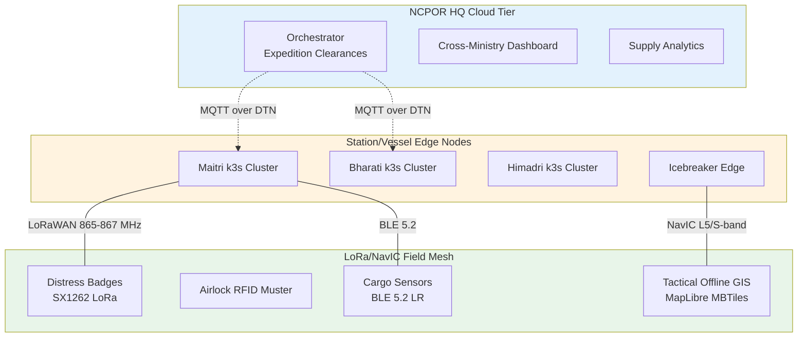

# Conversation History Archive

- **Archived At**: 2026-10-02T14:10:01.412621Z
- **Total Conversations**: 24
- **Users Represented**: 2

---

## User: Guest User (`guest@agentpilot.local`)
- **User ID**: `guest` | **Total Conversations**: 23

### 💬 Thread: New Conversation
- **ID**: `e95e0b52-32cd-4700-9877-a29aacdd223f` | **Messages**: 0
*Empty conversation*

### 💬 Thread: New Conversation
- **ID**: `test-thread-txt` | **Messages**: 0
*Empty conversation*

### 💬 Thread: New Conversation
- **ID**: `1f11fde7-8fa5-4f2a-8a03-93cf23391721` | **Messages**: 0
*Empty conversation*

### 💬 Thread: New chat
- **ID**: `1443dc62-1964-4961-9062-4bebbf29c75c` | **Messages**: 4
> **Human**: hi
> **Ai**: Hello! How can I help you today?
> **Human**: what are you doing
> **Ai**: I'm here to assist you with any questions or tasks you may have. How can I help you today?

### 💬 Thread: New chat
- **ID**: `22bbb6ba-dce6-4ab0-8934-6e3b6d080b49` | **Messages**: 8
> **Human**: hi
> **Ai**: Hello! How can I assist you today?
> **Human**: i want to know about stock price of AAPL
> **Ai**: 
> **Tool**: {"Global Quote": {"01. symbol": "AAPL", "02. open": "317.1000", "03. high": "320.7000", "04. low": "314.9000", "05. price": "316.2200", "06. volume": "35477090", "07. latest trading day": "2026-09-08", "08. previous close": "319.9700", "09. change": "-3.7500", "10. change percent": "-1.1720%"}}
> **Ai**: The current stock price of Apple Inc. (AAPL) is $316.22. Here are some additional details:
- Open: $317.10
- High: $320.70
- Low: $314.90
- Previous Close: $319.97
- Change: -$3.75
- Change Percent: -1.1720%
- Volume: 35,477,090
- Latest Trading Day: September 8, 2026

If you need more information or have any other queries, feel free to ask!
> **Human**: list my nov expences
> **Ai**: Sure, I can help you with that. To provide you with a list of your November expenses, I can perform a search using the DuckDuckGo Search function. Could you please provide me with more specific details or keywords related to your November expenses that will help me gather the necessary information?

### 💬 Thread: New chat
- **ID**: `29512cf0-daae-4071-847e-dfddfb976c12` | **Messages**: 6
> **Human**: what is my core skill
> **Ai**: To assist you in identifying your core skills, I would need more information about your background, experiences, and areas of expertise. You could describe your job, education, hobbies, or any specific fields you are interested in. This will help me provide a more tailored response.
> **Human**: what is my core skill, using that doc's
> **Ai**: 
> **Tool**: {"query": "What is my core skill?", "context": ["Intelligence, software development, and community building. I\nthrive at the intersection of writing code and empowering others,\ndriven by a continuous desire to learn, innovate, and build\nimpactful technology.   Current Focus: Machine LearningI recently\nachieved a major milestone in my tech journey by securing a\nMachine Learning internship at the She Can Foundation through\n@Internshala. In this role, I am transitioning my theoretical\nknowledge into practice by applying my programming foundation\nin Python to real-world AI initiatives. This internship allows me\nto dive deep into algorithm optimization, data analysis, and\nthe development of intelligent automation tools.   Certifications\n&amp; Student LeadershipI strongly believe in the power of\ntech communities and actively work to bridge the gap between\nstudents and premier career opportunities. I am honored to\nhold several leadership roles and official credentials:@Gemini\nCertified Student: Officially recognized by Google for Education", "MultimediaBeyond my focus on AI, I enjoy turning complex concepts\ninto functional, user-friendly digital experiences. I have hands-on\nexperience in frontend web development using HTML and CSS,\nhighlighted by building a fully responsive Amazon e-commerce\nclone from scratch.Additionally, I bring a strong background in digital\n  Page 1 of 3", "content creation. I regularly manage multimedia production, video\nediting, and live-streaming setups using tools like DaVinci Resolve\nand OBS Studio, blending my technical skills with creative execution.\nLet's Connect!I am always eager to network with fellow developers,\nAI professionals, and community builders. Whether it is collaborating\non an open-source project, discussing the future of Generative AI, or\nexploring new tech opportunities, I would love to connect!\nExperience\nShe Can Foundation\nMachine Learning Engineer\nAugust 2026 - Present (2 months)\nIndia\nSelected for a Machine Learning internship via Internshala to contribute to\nreal-world AI initiatives at the She Can Foundation.  \nApplying foundational programming skills in Python to assist in developing,\ntraining, and testing machine learning models.\nCollaborating with team members to analyze data and build impactful,\nautomated solutions.\nExpanding practical expertise in Artificial Intelligence, algorithm optimization,", "students and premier career opportunities. I am honored to\nhold several leadership roles and official credentials:@Gemini\nCertified Student: Officially recognized by Google for Education\nfor demonstrating the knowledge, skills, and basic competencies\nneeded to use Google AI in education.  @Microsoft Learn\nStudent Ambassador: Fostering a global tech community, sharing\nknowledge on emerging technologies, and guiding peers toward\ncertification paths.@Internshala Student Partner: Driving campus\nadvocacy, marketing, and connecting students with industry\nmasterclasses and upskilling opportunities.Campus Ambassador for\n@SmartEd Innovation: Leading community initiatives and promoting\neducational development on campus. Software Development &amp;\nMultimediaBeyond my focus on AI, I enjoy turning complex concepts\ninto functional, user-friendly digital experiences. I have hands-on\nexperience in frontend web development using HTML and CSS,"], "metadata": [{"producer": "Apache FOP Version 2.3", "creator": "PyPDF", "creationdate": "2026-09-09T13:25:50+00:00", "title": "Resume", "author": "LinkedIn", "subject": "Resume generated from profile", "source": "/tmp/tmpze5dmnn6.pdf", "total_pages": 3, "page": 0, "page_label": "1"}, {"producer": "Apache FOP Version 2.3", "creator": "PyPDF", "creationdate": "2026-09-09T13:25:50+00:00", "title": "Resume", "author": "LinkedIn", "subject": "Resume generated from profile", "source": "/tmp/tmpze5dmnn6.pdf", "total_pages": 3, "page": 0, "page_label": "1"}, {"producer": "Apache FOP Version 2.3", "creator": "PyPDF", "creationdate": "2026-09-09T13:25:50+00:00", "title": "Resume", "author": "LinkedIn", "subject": "Resume generated from profile", "source": "/tmp/tmpze5dmnn6.pdf", "total_pages": 3, "page": 1, "page_label": "2"}, {"producer": "Apache FOP Version 2.3", "creator": "PyPDF", "creationdate": "2026-09-09T13:25:50+00:00", "title": "Resume", "author": "LinkedIn", "subject": "Resume generated from profile", "source": "/tmp/tmpze5dmnn6.pdf", "total_pages": 3, "page": 0, "page_label": "1"}], "source_file": "Profile (1).pdf"}
> **Ai**: Your core skills appear to be centered around software development, particularly in machine learning, as well as community building and digital content creation. Here is a summary of your key skills:

1. **Machine Learning**: You are currently focusing on machine learning and have secured an internship with the She Can Foundation, where you are applying your Python programming skills to real-world AI initiatives, which includes algorithm optimization and data analysis.

2. **Software Development**: You have experience in frontend web development, particularly with HTML and CSS, and have built user-friendly digital experiences.

3. **Community Building**: You actively engage in tech communities and hold leadership roles that aim to connect students with career opportunities, emphasizing the importance of knowledge sharing and fostering a supportive environment.

4. **Certification and Recognition**: You are recognized as a Gemini Certified Student by Google for Education, and you are engaged as a Microsoft Learn Student Ambassador, demonstrating your commitment to ongoing learning and community involvement.

5. **Content Creation**: You have hands-on experience in multimedia production, video editing, and the technical setups for live-streaming, which showcases your ability to blend technical skills with creative execution.

Overall, your core skill lies at the intersection of technology and community empowerment, particularly through the lens of machine learning and software development.

### 💬 Thread: New chat
- **ID**: `4ec51744-aeb4-490a-9520-4b3c7c7f44b1` | **Messages**: 12
> **Human**: hi
> **Ai**: Hello! How can I assist you today?
> **Human**: what is the weather today
> **Ai**: I'm an AI and do not have access to real-time data. I recommend checking a weather website or app for the most up-to-date information on the weather in your area.
> **Human**: what is the weather today
> **Ai**: I apologize for the confusion. Can you please provide me with your location so that I can look up the weather for you?
> **Human**: at Bhopal MP
> **Ai**: As an AI language model, I do not have real-time data capabilities to provide current weather updates. I recommend checking a reliable weather website or app for the most up-to-date weather information for Bhopal, Madhya Pradesh.
> **Human**: what is the product of 1334 and 3234
> **Ai**: The product of 1334 and 3234 is 4,313,756.
> **Human**: what is the stock price of Appale
> **Ai**: I do not have real-time data and cannot provide the current stock price of Apple. I recommend checking a financial news website or a stock market app for the latest information on Apple's stock price.

### 💬 Thread: New chat
- **ID**: `53575531-5c66-4ab6-8341-a7301a715b87` | **Messages**: 2
> **Human**: hello
> **Ai**: Hello! How can I help you today?

### 💬 Thread: New chat
- **ID**: `813d6dbf-4ccb-4796-ad87-c39bc6878a46` | **Messages**: 7
> **Human**: suggest some graph's or flowchat we use in ppt, suggest and make for slides
> **Ai**: 
> **Tool**: {"query": "presentation structure slides graphs flowcharts architecture diagrams", "context": ["3. Interactive 3D Cargo Stowage Planner: A WebGL/Three.js cargo hold visualizer that prevents hazardous cargo co-location,\n optimizes center of gravity, and establishes priority offloading at the ice shelf.\n4. Madrid Protocol Automated Compliance Audit: A dedicated compliance engine that logs waste generation, tracks\n containerized waste retrograde, and generates mandatory Antarctic Treaty export declarations.\n8. Prototype Roadmap & Hackathon Presentation Structure\nA disciplined 6-slide presentation structure aligned with Smart India Hackathon scoring criteria:\n Slide 1: Mission Problem Context: NCPOR's extreme logistics environment, multi-month blackout windows, and single points\n of failure in legacy spreadsheets.\n Slide 2: Proposed 3-Tier Architecture: Diagram detailing Central Cloud, Station/Vessel Edge Nodes, and the LoRa/NavIC\n Field Mesh.\n Slide 3: Technical Novelty & DTN: CRDT delta synchronization, sub-zero battery survival (-55°C), and compact Protobuf", "positions.\n Algorithmic SAR dispatch optimizer generating expanding-square and sector-search rescue\nvectors.\n6. Technology Stack & Protocol Specifications\n Cloud & Edge Backend: Go (Golang) / Python FastAPI running on lightweight k3s containers. Go provides a minimal memory\n footprint and fast binary execution on rugged industrial hardware.\n Database & Distributed State: PostgreSQL with PostGIS for spatial spatial indexing; local edge persistence via SQLite, synced\n using Yjs/Automerge CRDT delta log streams.\n Client Platforms: React / Next.js progressive web application for station desktop terminals; Flutter for rugged handheld PDAs\n supporting hardware barcode and RFID scanners.\n Offline Cartography & GIS: MapLibre GL rendering self-hosted vector tiles (MBTiles) of polar topography, satellite rasters, and\n station blueprints with zero internet dependence.\n Field Hardware & Mesh: Semtech SX1262 LoRa transceivers (865–867 MHz), BLE 5.2 Long Range, NavIC L5/S-band GNSS", "Katabatic blizzards cause instant zero-visibility\nwhiteouts; hidden crevasses threaten traverse parties.\nWearable LoRaWAN distress badges with\nfall/man-down sensors, airlock RFID muster, and\ntactical offline GIS.\nTreaty Compliance\nPaper-based Madrid Protocol logs risk international\naudit fines and uncontrolled hazardous waste\naccumulation.\nCryptographically verified waste manifest tracking\nconsumables from dispatch through return\nincineration.\n4. End-to-End System Architecture\nThe system employs a Three-Tier Delay-Tolerant Architecture ensuring continuous, zero-downtime operations:\n1. Central Cloud Tier (NCPOR HQ, Goa): Deployed in MeitY-empaneled cloud data centers. Acts as the master orchestrator for\n expedition clearances, vendor procurement, cross-ministry logistics dashboards, and macro cryospheric supply analytics.\n2. Station & Vessel Edge Nodes (Maitri, Bharati, Himadri, Icebreaker): On-premise industrial rugged servers running", " National Centre for Polar and Ocean Research (NCPOR): https://ncpor.res.in/\n \n Ministry of Earth Sciences (MoES), Government of India: https://moes.gov.in/\n \n Indian Antarctic Research Stations (Maitri & Bharati): https://ncpor.res.in/antarcticas/display/377-bharati\n \n Indian Arctic Station (Himadri, Ny-Ålesund, Svalbard): https://ncpor.res.in/arctic/\n \n Protocol on Environmental Protection to the Antarctic Treaty (Madrid Protocol): https://www.ats.aq/e/protocol.html\n \n Smart India Hackathon (SIH) 2026 Problem Statements Master Catalogue: https://sih.gov.in/\n \nSMART INDIA HACKATHON 2026 | PROBLEM STATEMENT 26062\nNCPOR / MoES — Integrated Polar Logistics System\nGovernment of India | Ministry of Earth Sciences | National Centre for Polar and Ocean Research\nPage 4 of 4", "extreme isolation, sub-zero temperatures (-30°C to -80°C), katabatic storms exceeding 100 knots, and complete physical cutoff for\n8 to 9 winter months.\nExisting operational workflows are impeded by fragmented legacy systems: cargo manifests are maintained in disparate\nspreadsheets, container packing lacks 3D stowage visibility, cold-chain status for irreplaceable ice cores is monitored manually,\nand personnel field parties operate without automated muster and distress telemetry. SIH Problem Statement 26062 mandates an\nintegrated, centralized, and delay-tolerant digital platform encompassing expedition planning, multimodal cargo tracking,\nsub-zero inventory control, personnel safety, and automated emergency SAR response.\n2. Operational Domain & Multimodal Supply Corridors\nNCPOR manages an interconnected multimodal logistics pipeline coordinating air, sea, and surface operations:"], "metadata": [{"producer": "ReportLab PDF Library - www.reportlab.com", "creator": "(unspecified)", "creationdate": "2026-09-17T08:19:00+00:00", "author": "(anonymous)", "keywords": "", "moddate": "2026-09-17T08:19:00+00:00", "subject": "(unspecified)", "title": "(anonymous)", "trapped": "/False", "source": "/tmp/tmp1czvrgv5.pdf", "total_pages": 4, "page": 3, "page_label": "4"}, {"producer": "ReportLab PDF Library - www.reportlab.com", "creator": "(unspecified)", "creationdate": "2026-09-17T08:19:00+00:00", "author": "(anonymous)", "keywords": "", "moddate": "2026-09-17T08:19:00+00:00", "subject": "(unspecified)", "title": "(anonymous)", "trapped": "/False", "source": "/tmp/tmp1czvrgv5.pdf", "total_pages": 4, "page": 2, "page_label": "3"}, {"producer": "ReportLab PDF Library - www.reportlab.com", "creator": "(unspecified)", "creationdate": "2026-09-17T08:19:00+00:00", "author": "(anonymous)", "keywords": "", "moddate": "2026-09-17T08:19:00+00:00", "subject": "(unspecified)", "title": "(anonymous)", "trapped": "/False", "source": "/tmp/tmp1czvrgv5.pdf", "total_pages": 4, "page": 1, "page_label": "2"}, {"producer": "ReportLab PDF Library - www.reportlab.com", "creator": "(unspecified)", "creationdate": "2026-09-17T08:19:00+00:00", "author": "(anonymous)", "keywords": "", "moddate": "2026-09-17T08:19:00+00:00", "subject": "(unspecified)", "title": "(anonymous)", "trapped": "/False", "source": "/tmp/tmp1czvrgv5.pdf", "total_pages": 4, "page": 3, "page_label": "4"}, {"producer": "ReportLab PDF Library - www.reportlab.com", "creator": "(unspecified)", "creationdate": "2026-09-17T08:19:00+00:00", "author": "(anonymous)", "keywords": "", "moddate": "2026-09-17T08:19:00+00:00", "subject": "(unspecified)", "title": "(anonymous)", "trapped": "/False", "source": "/tmp/tmp1czvrgv5.pdf", "total_pages": 4, "page": 0, "page_label": "1"}], "source_file": "SIH2026_Problem_26062_Polar_Logistics_Blueprint.pdf"}
> **Human**: suggest some graph's or flowchat we use in ppt, suggest and make for slides
> **Ai**: Based on the **SIH 2026 Problem Statement 26062 (NCPOR Integrated Polar Logistics System)** PDF you've uploaded, here are **specific graph/flowchart suggestions for each slide** of the recommended 6-slide hackathon presentation structure, along with **creation guidance**.

---

## 🎯 **Slide-by-Slide Visual Recommendations**

| Slide | Title | Recommended Visual(s) | Purpose |
|-------|-------|------------------------|---------|
| **1** | **Mission Problem Context** | 1. **Pain-Point Radar Chart** (5 axes: Cargo Visibility, Cold-Chain Monitoring, Personnel Safety, Treaty Compliance, Communication Blackout)  <br>2. **Timeline/Gantt** showing 8–9 month winter isolation window vs. current manual workflow delays | Quantify the “why now” – show multi-dimensional failure of legacy spreadsheets |
| **2** | **Proposed 3-Tier Architecture** | 1. **Layered Architecture Diagram** (Cloud → Edge → Field Mesh) with **protocol annotations** (MQTT, LoRaWAN, NavIC, CRDT sync)  <br>2. **Data-Flow Sankey** showing cargo manifest → edge cache → cloud sync → dashboard | Make the delay-tolerant topology instantly graspable |
| **3** | **Technical Novelty & DTN** | 1. **CRDT State-Merge Animation** (sequence diagram: offline write → delta log → merge → conflict-free)  <br>2. **Thermal Survival Bar Chart** (Li-ion vs. LTO vs. super-capacitor at –55 °C)  <br>3. **Protobuf vs. JSON Size Comparison** (stacked bar) | Prove novelty with hard numbers & visual protocol logic |
| **4** | **Operational Workflows** | 1. **Cargo Stowage Swimlane** (HQ Planning → Ship Load → Ice-Shelf Offload → Priority Unload)  <br>2. **SAR Dispatch Decision Tree** (Distress Badge → Fall Detect → Expanding-Square Search → Helicopter Launch)  <br>3. **Madrid Protocol Compliance Flow** (Waste Gen → Containerize → Retrograde → Crypto Manifest → Audit Export) | Show end-to-end automation replacing paper/Excel |
| **5** | **Impact Metrics & Validation** | 1. **KPI Dashboard Mockup** (4 gauges: Cargo Turnaround ↓40%, Cold-Chain Excursions → 0, SAR Response <15 min, Audit Prep ↓80%)  <br>2. **Before/After Radar** (same 5 axes as Slide 1, now green)  <br>3. **Monte-Carlo Simulation Histogram** (10k runs of crevasse traverse risk with/without LoRa badges) | Evidence-based impact for judges |
| **6** | **Call to Action / Next Steps** | 1. **Milestone Roadmap** (Gantt: Prototype → Field Trial @ Maitri → Scale to Bharati/Himadri → MoES Rollout)  <br>2. **Team & Partner Logos Cloud** (NCPOR, MoES, SIH, Industry Mentors) | Leave a clear path forward |

---

## 🛠️ **Tools & Quick-Creation Recipes**

| Visual Type
> **Human**: continue
> **Ai**: | Visual Type | Best Free Tools | 2-Minute Starter Template |
|-------------|----------------|---------------------------|
| **Layered Architecture** | **draw.io / diagrams.net** (offline desktop app) | `File → New → Network → Cloud Architecture` → drag 3 clusters (Cloud/Edge/Field) → connect with protocol labels |
| **Sequence / State-Merge** | **Mermaid Live Editor** (mermaid.live) or **PlantUML** | Paste: `sequenceDiagram\n  participant Edge\n  participant Cloud\n  Edge->>Cloud: CRDT Delta Sync\n  Cloud-->>Edge: Ack + Merge` |
| **Sankey / Flow** | **SankeyMATIC** (sankeymatic.com) or **Observable Plot** | Copy CSV: `Source,Target,Value\nHQ,Ship,120\nShip,IceShelf,110\nIceShelf,PriorityUnload,90` |
| **Radar / KPI Gauges** | **Chart.js** (CDN) or **Excel/Google Sheets** → Insert → Chart → Radar | Sheets: 5 columns (Axes) × 2 rows (Before/After) → Chart → Radar |
| **Decision Tree (SAR)** | **draw.io** → `Flowchart → Decision Tree` template | Diamond nodes for sensors → rectangles for actions → auto-layout |
| **Gantt / Roadmap** | **Mermaid** (`gantt` syntax) or **Notion/Trello** export | ```mermaid\ngantt\ntitle Prototype Roadmap\ndateFormat YYYY-MM-DD\nsection Prototype\nCore DTN Sync :a1, 2024-10-01, 30d\n3D Stowage :a2, after a1, 20d\nsection Field Trial\nMaitri Deploy :b1, 2024-12-01, 45d\n``` |
| **Thermal / Size Bars** | **Chart.js** or **Python matplotlib** (one-liner) | `plt.barh(['Li-ion','LTO','Supercap'], [2h, 18h, 48h])` at –55 °C |

---

## 📋 **Copy-Paste Mermaid Snippets** (render in GitHub, Notion, Obsidian, VS Code, HackMD)

### 1. **3-Tier Architecture** (Slide 2)


### 2. **CRDT Delta Sync Sequence** (Slide 3)
```mermaid
sequenceDiagram
    autonumber
    participant Edge as Edge Node (Offline)
    participant Log as Yjs/Automerge Delta Log
    participant Cloud as Central Cloud
    Edge->>Log: Local Write (Cargo Manifest)
    Log->>Log: Generate Delta (CRDT Op)
    Note right of Log: Sub-zero persistence\nSQLite + WAL
    Cloud-->>Edge: Connectivity Restored
    Edge->>Cloud: Push Delta Stream (Protobuf)
    Cloud->>Cloud: Merge (Conflict-Free)
    Cloud-->>Edge: Ack + Merg

### 💬 Thread: New chat
- **ID**: `b8d79619-ebda-4e26-869b-24c1d6dd439e` | **Messages**: 2
> **Human**: what is Agentic AI
> **Ai**: Agentic AI refers to artificial intelligence systems that are designed to act autonomously and make decisions independently of human interaction. These systems are typically programmed to be goal-oriented and task-focused, with the ability to learn from data and adapt their behavior to achieve their objectives. Agentic AI is often used in scenarios where quick and efficient decision-making is required, such as in autonomous vehicles, robotic systems, and virtual assistants.

### 💬 Thread: New chat
- **ID**: `e80cfc5c-70ea-413e-a552-bceb78aa58ad` | **Messages**: 2
> **Human**: hi
> **Ai**: Hello! How can I help you today? If you have a PDF you'd like me to analyze, please upload it first. Otherwise, feel free to ask me any question!

### 💬 Thread: New chat
- **ID**: `eca6d1d7-fc12-4fd7-84ed-8990d90d75a6` | **Messages**: 2
> **Human**: hi
> **Ai**: Hello! How can I assist you today?

### 💬 Thread: New chat
- **ID**: `fd076225-7fe8-4104-b32e-48e17358c479` | **Messages**: 8
> **Human**: what is the top news in india
> **Ai**: 
> **Tool**: The top 10 cryptocurrency news media in India encompass leading digital platforms dedicated to delivering specialized coverage of blockchain technologies, cryptocurrency market analyses, regulatory shifts, and India-specific developments, particular… Get the latest updates and breaking news from India, including politics, elections, government, business, technology, and Bollywood. Hindustan Times: Stay updated with Hindustan Times for the top India news, world events, and breaking stories. Get real-time updates on politics, wars, live cricket scores, entertainment news, and ... Times of India brings the Latest News & Breaking News Headlines from India & around the World. Read Latest News Today on Sports, Business, Health & Fitness, Bollywood & Entertainment, Blogs ... Get the in-depth latest India news today with realtime live updates, breaking headlines, political coverage, photos, videos & top stories only on News24
> **Ai**: The top news in India covers a wide range of topics including politics, elections, government, business, technology, and Bollywood. Some of the top news sources in India providing current updates are Hindustan Times, Times of India, and News24. You can visit these websites to get the latest updates on various aspects of news in India.
> **Human**: what is the product of 2134 and 324
> **Ai**: 
> **Tool**: {"first_num": 2134.0, "second_num": 324.0, "operation": "mul", "result": 691416.0}
> **Ai**: The product of 2134 and 324 is 691,416.

### 💬 Thread: New chat
- **ID**: `thread-1` | **Messages**: 6
> **Human**: What is the Langgraph
> **Ai**: The Langgraph is a linguistic theory proposed by Noam Chomsky in the early 1950s. It suggests that there is a deep structure underlying all languages, and that this deep structure can be represented by a universal grammar that is common to all languages. According to Chomsky, the Langgraph is a mental representation of the underlying principles of language that allows humans to generate and interpret an infinite number of sentences.
> **Human**: What is ask
> **Ai**: "Ask" is a verb that means to inquire about something by posing a question. It is used when seeking information, guidance, advice, or an opinion from someone else. For example, "I will ask my teacher for help with my homework" or "Can I ask you a question?"
> **Human**: What i ask
> **Ai**: I'm sorry, but I do not understand what you are asking. Can you provide more context or clarify your question so that I can assist you better?

### 💬 Thread: hi
- **ID**: `2be32838-02b1-4da1-9184-f2a75566e74f` | **Messages**: 4
> **Human**: hi
> **Ai**: Hi! How can I help you today?
> **Human**: hello again
> **Ai**: Hello! How can I help you?

### 💬 Thread: hi
- **ID**: `test-browser-thread` | **Messages**: 2
> **Human**: hi
> **Ai**: Hello! How can I help you today?

### 💬 Thread: hi
- **ID**: `c8133481-d9ae-427f-926a-b3962289a780` | **Messages**: 2
> **Human**: hi
> **Ai**: Hi! How can I help you today?

### 💬 Thread: New Conversation
- **ID**: `test-thread` | **Messages**: 0
*Empty conversation*

### 💬 Thread: Analyze this dataset structure: Month,Signups,Ch
- **ID**: `f3624aa1-0fd6-4a74-8608-9228d346ce24` | **Messages**: 4
> **Human**: Analyze this dataset structure: Month,Signups,Churn,Revenue
Jan,1200,45,24000
Feb,1500,50,30000
Mar,1850,52,37000
> **Ai**: 
> **Tool**: {"total_rows": 3, "total_columns": 4, "columns": ["Month", "Signups", "Churn", "Revenue"], "summary": {"Month": {"type": "categorical/text", "count": 3, "unique": 3}, "Signups": {"type": "numeric", "count": 3, "min": 1200.0, "max": 1850.0, "avg": 1516.67}, "Churn": {"type": "numeric", "count": 3, "min": 45.0, "max": 52.0, "avg": 49.0}, "Revenue": {"type": "numeric", "count": 3, "min": 24000.0, "max": 37000.0, "avg": 30333.33}}}
> **Ai**: 

### 💬 Thread: Analyze this dataset structure: Month,Signups,Ch
- **ID**: `01cba17d-27d0-44d8-aa74-35e481d563e1` | **Messages**: 4
> **Human**: Analyze this dataset structure: Month,Signups,Churn,Revenue
Jan,1200,45,24000
Feb,1500,50,30000
Mar,1850,52,37000
> **Ai**: 
> **Tool**: {"total_rows": 3, "total_columns": 4, "columns": ["Month", "Signups", "Churn", "Revenue"], "summary": {"Month": {"type": "categorical/text", "count": 3, "unique": 3}, "Signups": {"type": "numeric", "count": 3, "min": 1200.0, "max": 1850.0, "avg": 1516.67}, "Churn": {"type": "numeric", "count": 3, "min": 45.0, "max": 52.0, "avg": 49.0}, "Revenue": {"type": "numeric", "count": 3, "min": 24000.0, "max": 37000.0, "avg": 30333.33}}}
> **Ai**: This dataset contains **3 months** of business metrics (Jan–Mar) with **4 columns**:

| Column | Type | Range / Stats |
|--------|------|---------------|
| **Month** | Categorical | 3 unique values (Jan, Feb, Mar) |
| **Signups** | Numeric | 1,200 → 1,850 (avg **1,517**) |
| **Churn** | Numeric | 45 → 52 (avg **49**) |
| **Revenue** | Numeric | $24,000 → $37,000 (avg **$30,333**) |

### Key Observations
- **Growth trend**: Signups and Revenue are increasing month-over-month.
- **Churn** is relatively stable (~3% of signups) but slightly rising.
- **Revenue per signup** ≈ $20/month (30,333 ÷ 1,517).

Would you like me to calculate any derived metrics (e.g., net growth, retention rate, LTV estimate) or visualize trends?

### 💬 Thread: Fetch and summarize the latest updates from http
- **ID**: `4d9d086c-cff0-48e3-b181-f7b8d2a7da0a` | **Messages**: 4
> **Human**: Fetch and summarize the latest updates from https://news.ycombinator.com
> **Ai**: 
> **Tool**: {"url": "https://news.ycombinator.com", "status_code": 200, "title": "Hacker News", "content": "Hacker News Hacker News new | past | comments | ask | show | jobs | submit login 1. Pi 1.0 ( earendil.com ) 1428 points by sergiotapia 17 hours ago | hide | 466&nbsp;comments 2. Shimano Bicycle Museum Review ( inrng.com ) 162 points by pietroppeter 7 hours ago | hide | 27&nbsp;comments 3. Several vulnerabilities have been discovered in the Linux kernel ( lwn.net ) 383 points by luispa 13 hours ago | hide | 278&nbsp;comments 4. Show HN: Audionaut – an open-source cross-platform multitrack audio editor ( github.com/kvoltmer ) 42 points by vltmrkls 4 hours ago | hide | 13&nbsp;comments 5. Harvard particle physicist Matthew Schwartz drops 36 papers authored with Claude ( reddit.com ) 22 points by xqcgrek2 32 minutes ago | hide | 8&nbsp;comments 6. Clef: Open-weight decision models, and new RL fine-tuning platform ( cloudflare.com ) 545 points by jasondavies 20 hours ago | hide | 194&nbsp;comments 7. SvelteKit 3 ( svelte.dev ) 322 points by sampsn 16 hours ago | hide | 125&nbsp;comments 8. DeepSeek Harness Desktop for macOS and Windows ( deepseek.com ) 276 points by Kuyawa 9 hours ago | hide | 143&nbsp;comments 9. European payments groups join forces to challenge US dominance ( rte.ie ) 21 points by vrganj 1 hour ago | hide | 15&nbsp;comments 10. Pi Durable ( earendil.com ) 416 points by paulsmith 17 hours ago | hide | 55&nbsp;comments 11. Ask HN: Who is hiring? (October 2026) 216 points by whoishiring 21 hours ago | hide | 212&nbsp;comments 12. Git 3.0&#x27;s upcoming SHA-256 default will be a costly mistake ( gitbutler.com ) 425 points by chmaynard 19 hours ago | hide | 399&nbsp;comments 13. Automatic Transmission – a data-privacy study of connected vehicles ( northeastern.edu ) 203 points by rafaelc 16 hours ago | hide | 177&nbsp;comments 14. StreetComplete on iOS is now in public beta ( github.com/streetcomplete ) 581 points by Snowly 1 day ago | hide | 158&nbsp;comments 15. Frog and Toad and the Increasingly Capable Machines ( frogandtoad.ai ) 245 points by supermdguy 14 hours ago | hide | 58&nbsp;comments 16. Turbo Haskell ( comonad.com ) 128 points by pjmlp 11 hours ago | hide | 25&nbsp;comments 17. Using Opus 5.5 to discover a new eyewitness record of the dodo ( resobscura.substack.com ) 170 points by benbreen 15 hours ago | hide | 45&nbsp;comments 18. RIP, vector database ( turbopuffer.com ) 346 points by razin 20 hours ago | hide | 97&nbsp;comments 19. Alarm Grows over &#x27;Clearly Illegal&#x27; US Election Meddling in Brazil ( commondreams.org ) 25 points by robtherobber 2 hours ago | hide | 1&nbsp;comment 20. Various Projects Find Hidden SDR Capabilities in ESP32 Microcontrollers ( rtl-sdr.com ) 245 points by nkw 21 hours ago | hide | 46&nbsp;comments 21. How Singapore&#x27;s government-run dating service works ( singapore-samizdat.com ) 199 points by danielfoster 10 hours ago | hide | 186&nbsp;comments 22. Vote on which of Hacker News&#x27; challenges for AI have been met ( stoppels.ch ) 169 points by stabbles 19 hours ago | hide | 193&nbsp;comments 23. CSS Bed: Classless CSS themes to use as starting points in web development ( cssbed.com ) 124 points by sea-gold 15 hours ago | hide | 35&nbsp;comments 24. Show HN: Janus – Go binary that runs GGUF models via Vulkan on AMD&#x2F;Intel&#x2F;Nvidia ( github.com/vibra-ingenn ) 81 points by Maverick617 16 hours ago | hide | 14&nbsp;comments 25. ArXiv&#x27;s Updated Rate Limit Policy ( arxiv.org ) 128 points by 50kIters 16 hours ago | hide | 62&nbsp;comments 26. Cloudflare K2: serverless event streams ( cloudflare.com ) 253 points by elffjs 22 hours ago | hide | 98&nbsp;comments 27. Context Language Models ( arxiv.org ) 153 points by emersonmacro 21 hours ago | hide | 41&nbsp;comments 28. Oxygen-deprived underwater zones may not be “dead zones” but clue to early life ( wiley.com ) 109 points by gumby 17 hours ago | hide | 15&nbsp;comments 29. How to speed up the Rust compiler in September 2026 ( nnethercote.github.io ) 260 points by trickypr 1 day ago | hide | 145&nbsp;comme", "total_chars": 4306}
> **Ai**: Here's a summary of the latest Hacker News front page stories (as of the fetch):

### Top Stories by Category

**Technology & Development**
- **Git 3.0's SHA-256 default** (425 pts) — Debate over whether the upcoming change will be a costly mistake
- **SvelteKit 3 released** (322 pts) — Major update to the Svelte framework
- **Turbo Haskell** (128 pts) — Performance improvements for Haskell compilation
- **Janus** (Show HN, 81 pts) — Go binary running GGUF models via Vulkan on AMD/Intel/Nvidia
- **CSS Bed** (124 pts) — Classless CSS themes for web development starting points

**AI & Machine Learning**
- **Clef** (545 pts) — Cloudflare's open-weight decision models + RL fine-tuning platform
- **DeepSeek Harness Desktop** (276 pts) — Local LLM runner for macOS/Windows
- **Harvard physicist drops 36 papers authored with Claude** (22 pts) — AI-assisted research
- **"RIP, vector database"** (346 pts) — Discussion on vector DB relevance
- **Context Language Models** (153 pts, arXiv) — New research paper

**Security & Privacy**
- **Multiple Linux kernel vulnerabilities** (383 pts, LWN) — Several newly discovered issues
- **Automatic Transmission** (203 pts) — Data-privacy study of connected vehicles (Northeastern)
- **ESP32 hidden SDR capabilities** (245 pts) — Software-defined radio found in microcontrollers

**Science & Interesting Reads**
- **Pi 1.0 & Pi Durable** (1428 + 416 pts) — Earendil's new releases
- **Using Opus 5.5 to discover new dodo eyewitness record** (170 pts) — Historical research
- **Oxygen-deprived underwater zones** (109 pts) — Not "dead zones" but clues to early life
- **Frog and Toad and the Increasingly Capable Machines** (245 pts) — AI commentary

**Business & Policy**
- **European payments groups challenge US dominance** (21 pts, RTE)
- **Alarm over US election meddling in Brazil** (25 pts)
- **ArXiv's updated rate limit policy** (128 pts)
- **How Singapore's government-run dating service works** (199 pts)

**Community**
- **Ask HN: Who is hiring? (October 2026)** (216 pts)
- **Vote on HN's AI challenges** (169 pts)
- **Shimano Bicycle Museum Review** (162 pts) — Unexpected non-tech hit
- **StreetComplete iOS public beta** (581 pts) — OpenStreetMap contributor app

The front page shows a strong mix of systems programming, AI/ML tooling, security research, and a few delightful curveballs (bicycle museum, dodo research, government dating service).

### 💬 Thread: Fetch and summarize the latest updates of Agenti
- **ID**: `143db994-eca5-4ff3-9277-510c321ad630` | **Messages**: 4
> **Human**: Fetch and summarize the latest updates of Agentic AI
> **Ai**: 
> **Tool**: {"provider": "tavily", "query": "Agentic AI latest updates 2024 2025 news developments", "answer": "The sources indicate a significant surge in agentic AI developments from 2024 to 2025, with 24 out of 30 agents either released or receiving major updates during this period. The 2025 AI Agent Index documents a rapid increase in the deployment of agentic AI systems, highlighting advancements in reasoning, learning, planning, and collaboration. Trends include the rise of Agentic RAG, Deep Research Agents, Coding Agents, and Voice Agents, showcasing a shift towards multi-agent orchestration. Microsoft Build 2025 showcased evolving capabilities of GitHub Copilot and the introduction of new pre-built agents and custom agent building blocks. The role of agentic AI in shaping a smart future is underscored by its impact on productivity, cost reduction, and innovation, despite challenges in privacy and security.", "results": [{"title": "The 2025 AI Agent IndexDocumenting Technical and Safety Features of Deployed Agentic AI Systems", "url": "https://arxiv.org/html/2602.17753v1", "content": "Most agents were released in 2024-2025, indicating a recent surge in agent deployment. 24/30 agents were released or received major agentic feature updates during this period, with earlier systems like ChatGPT (2022) and Perplexity (2022) adding agentic capabilities later. While the underlying models (such as GPT-4) are older, agents meeting our inclusion criteria are emerging at an increasing rate, with a surge of releases in late 2024 and 2025 (see Figures 9 and 10). This separates capability [...] Barrow (2024)  Nicholas Barrow. 2024.  Anthropomorphism and AI Hype.  AI and Ethics 4, 3 (Aug. 2024), 707–711.   doi:10.1007/s43681-024-00454-1\n Bastian (2026)  Matthias Bastian. 2026.  Malicious skills turn AI agent OpenClaw into a malware delivery system.  The Decoder (8 Feb. 2026). [...] Figure 13. Changes in annotation fields across categories since the 2024 Index. We make significant changes across all sections compared to the 2024 Index (Casper et al., 2025): 16 fields in the 2025 version are completely new, and only 9 fields are kept unaltered (Keep). The remaining 16 fields were derived from fields in the 2024 version either by making significant modifications to the definition/notes (Modify), splitting a field (Split), or merging multiple fields into one (Merge). 8 fields", "score": 0.8803145}, {"title": "AI Agent trends have drastically changed from 2024 to 2025", "url": "https://www.linkedin.com/posts/rakeshgohel01_ai-agent-trends-have-drastically-changed-activity-7383841580014723072-PxZp", "content": "Fascinating overview, Rakesh 👏 The evolution of AI Agents from 2024 to 2025 clearly shows how fast the ecosystem is maturing — from simple task automation to autonomous, reasoning-driven systems capable of learning, planning, and collaborating. The rise of Agentic RAG, Deep Research Agents, Coding Agents, and Voice Agents reflects a shift toward multi-agent orchestration, where AI not only executes but also thinks, adapts, and communicates. As someone leading technology-driven transformation [...] transformation initiatives, I see massive potential for these agentic frameworks to revolutionize mining, industrial automation, and decision intelligence, connecting data, processes, and people like never before. ⚙️🤖 #AIAgents #AgenticAI #Innovation #ArtificialIntelligence #Automation #DigitalTransformation #AI2025 #FutureOfWork #MachineLearning #Leadership [...] AI Agent trends have drastically changed from 2024 to 2025 Here are the new trends driving innovation this year.... The Agentic AI field is constantly moving forward with new innovations and products. I'll share with you a few notable trends that are driving the market in 2025. Note: I've also included a few Langgraph codebooks if you want to build some of these solutions yourself. 📌 Agentic RAG - AI Agent workflow for reasoning-based real-time data retrieval and generation. - Agentic RAG is", "score": 0.84277284}, {"title": "The role of agentic AI in shaping a smart future", "url": "https://www.sciencedirect.com/science/article/pii/S2590005625000268", "content": "by S Hosseini · 2025 · Cited by 428 — Findings reveal that Agentic AI significantly improves productivity, reduces costs, and drives innovation, though challenges such as privacy, security, and", "score": 0.7644879}, {"title": "Microsoft Build 2025: The age of AI agents and building the open agentic web - The Official Microsoft Blog", "url": "https://blogs.microsoft.com/blog/2025/05/19/microsoft-build-2025-the-age-of-ai-agents-and-building-the-open-agentic-web", "content": "GitHub Copilot coding agent and new updates to GitHub Models: GitHub Copilot is evolving from an in-editor assistant to an agentic AI partner with a first-of-its-kind asynchronous coding agent integrated into the GitHub platform. We’re adding prompt management, lightweight evaluations and enterprise controls to GitHub Models so teams can experiment with best-in-class models, without leaving GitHub. Microsoft is also open-sourcing GitHub Copilot Chat in VS Code. The AI-powered capabilities from [...] We’ve entered the era of AI agents. Thanks to groundbreaking advancements in reasoning and memory, AI models are now more capable and efficient, and we’re seeing how AI systems can help us all solve problems in new ways.\n\nFor example, 15 million developers are already using GitHub Copilot, and features like agent mode and code review are streamlining the way they code, check, deploy and troubleshoot. [...] ### Making AI agents more capable and secure\n\nAI agents are not only changing how developers build, but how individuals, teams and companies get work done. At Build, we’re unveiling new pre-built agents, custom agent building blocks, multi-agent capabilities and new models to help developers and organizations build and deploy agents securely to help increase productivity in meaningful ways.", "score": 0.74563974}, {"title": "The Emerging Agentic Enterprise: How Leaders Must Navigate a New Age of AI", "url": "https://sloanreview.mit.edu/projects/scholars/the-emerging-agentic-enterprise-how-leaders-must-navigate-a-new-age-of-ai", "content": "Teaming across our practices, and in close collaboration with our clients, our end-to-end global team unlocks new possibilities. Together we’re creating the bold and disruptive products, services, and businesses of tomorrow.\n\n#### References\n\n1. S. Ransbotham and S. Khodabandeh, hosts, “Overcoming AI Hallucinations: Truist’s Chandra Kapireddy,” “Me, Myself, and AI,” podcast, season 11, episode 3 (April 15, 2025), MIT Sloan Management Review, \n\n2. Ibid. [...] Todd Fitz, Kevin Foley, Sarah Johnson, Matt Langione, Michele Lee DeFilippo, Amanda Luther, Jennifer Martin, Samantha Oldroyd, Meenal Pore, Allison Ryder, Taylor Zhang, Leila Zhu, Leonid Zhukov, David Zuluaga Martínez\n\nTo cite this report, please use:\n\nS. Ransbotham, D. Kiron, S. Khodabandeh, S. Iyer, and A. Das, “The Emerging Agentic Enterprise: How Leaders Must Navigate a New Age of AI,” MIT Sloan Management Review and Boston Consulting Group, November 2025.\n\n##### Acknowledgments: [...] 2. Ibid.\n\n3. I. Bousquette, “Why Moderna Merged Its Tech and HR Departments,” The Wall Street Journal, May 12, 2005, www.wsj.com.\n\ni. C. Halton, “Diffusion of Innovations Theory: Definition and Examples,” Investopedia, May 27, 2025, www.investopedia.com.\n\n#### Tags:\n\n AI Strategy Employee Morale Generative AI Tradeoffs\n\n#### Reprint #:\n\n67270\n\n#### More Like This\n\n### Add a comment Cancel reply", "score": 0.7420672}, {"title": "Top 15 Agentic AI Trends to Watch in 2026", "url": "https://www.firecrawl.dev/blog/agentic-ai-trends", "content": "39% of U.S. consumers have already used AI for online shopping, and 53% plan to in 2025. By year-end, agents are expected to handle 20% of e-", "score": 0.5596998}, {"title": "10+ Agentic AI Trends and Examples", "url": "https://aimultiple.com/agentic-ai-trends", "content": "eesel AI7.\n\nGenerative AI in organizations 2024 - Capgemini USA\n\nCapgemini\n\nCem Dilmegani\n\nCem Dilmegani\n\nPrincipal Analyst\n\nFollow On [...] Key points:\n\n Human-AI collaboration: The effectiveness of agentic AI will rely on how effectively teams can collaborate with AI agents, using them as co-workers.\n Cultural shift: Adopting agentic AI will require a significant shift in organizational culture, focusing not on technology adoption but also on allowing people to work alongside AI to reach new heights of productivity.\n\n## 11. Emergence of new AI agent pricing models [...] Last updated:September 27, 2026\n\nDownload\n\nWant the granular data behind it?Join Premium\n\n## Changelog\n\n3 updates\n\n1. Replaced the Hippocratic AI nurse pricing example with Telefónica's voice agent cost data.\n2. Added autonomous web agents and copilots to the vertical AI agent examples list.\n\n## Reference Links\n\n1.\n\nMonte Carlo Launches Observability Agents To Accelerate Data + AI Monitoring And Troubleshooting2.", "score": 0.5345888}, {"title": "7 best agentic AI platforms in 2026 | Market guide", "url": "https://www.kore.ai/blog/7-best-agentic-ai-platforms", "content": "Academy\n\nCommunity\n\nCOMPANY\n\nAbout us\n\nLeadership\n\nCustomer Stories\n\nPartners\n\nAnalyst Recognition\n\nNewsroom\n\nEvents\n\nCareers\n\nContact us\n\nMicrosoft Partnership\n\nAgentic AI Guides\n\nforrester cx wave 2024 Kore at top\n\nKore.ai named a leader in The Forrester Wave™: Conversational AI for Customer Service, Q2 2024\n\nGenerative AI 101\n\nCXO AI toolkit for enterprise AI success\n\nupcoming event\n\nNo items found.\n\nTalk to an expert [...] More broadly, now that ServiceNow acquired (agreed to acquire) Moveworks in a deal announced on March 10, 2025, enterprises may want to keep an eye on how the platform’s roadmap and packaging evolve over time.\n\n### Key features of Moveworks: [...] That said, Moveworks remains firmly centred on employee support automation, with limited reach into customer-facing, back-office, or wider enterprise workflows. Even within employee support, Forrester, in its Forrester Wave™: Cognitive Search Platforms, Q4 2025, notes that its ability to understand and extract meaning from images and other visual formats is still evolving, which may affect how fully certain IT or HR issues can be resolved end-to-end without human help.", "score": 0.53065056}, {"title": "Agentic AI Market Report 2026- 2033, Application Type, Geo, Tech", "url": "https://www.marketsandmarkets.com/Market-Reports/agentic-ai-market-208190735.html", "content": "| REPORT METRIC | DETAILS |\n --- |\n| Market Size in 2025 (Value) | USD 11.56 Billion |\n| Market Forecast in 2026 (Value) | USD 19.33 Billion |\n| Market Forecast in 2033 (Value) | USD 205.88 Billion |\n| Growth Rate | 40.2% |\n| Years Considered | 2023–2033 |\n| Base Year | 2025 |\n| Forecast Period | 2026–2033 |\n| Units Considered | Value (USD Billion) |\n| Report Coverage | Revenue forecast, company ranking, competitive landscape, growth factors, and trends | [...] was estimated to drive USD 40 million in profit improvement in 2024. | [...] 5.6.1\n\nAVERAGE SELLING PRICE OF OFFERING, BY KEY PLAYER,\n\n5.6.2\n\nAVERAGE SELLING PRICE, BY SYSTEM ARCHITECTURE,\n\n5.7\n\nKEY CONFERENCES AND EVENTS, 2026–2027\n\n5.8\n\nTRENDS/DISRUPTIONS IMPACTING CUSTOMER BUSINESS\n\n5.9\n\nINVESTMENT AND FUNDING SCENARIO\n\n5.10\n\nCASE STUDY ANALYSIS\n\n5.11\n\nIMPACT OF 2025 US TARIFF – AGENTIC AI MARKET\n\n5.11.1\n\nINTRODUCTION\n\n5.11.2\n\nKEY TARIFF RATES\n\n5.11.3\n\nPRICE IMPACT ANALYSIS\n\n5.11.4\n\nIMPACT ON COUNTRIES/REGIONS\n\n5.11.4.1\n\nUS\n\n5.11.4.2\n\nEUROPE\n\n5.11.4.3\n\nCHINA", "score": 0.46949652}, {"title": "The state of AI in 2026: On the road to ROI", "url": "https://www.mckinsey.com/capabilities/quantumblack/our-insights/the-state-of-ai", "content": "These larger organizations have moved more quickly than smaller ones over the past year in their use of agentic AI. The share scaling agents in one or more functions increased from 27 percent to 40 percent, while adoption among smaller organizations remained essentially flat, at 22 percent (Exhibit 2).\n\nExhibit 2\n\nImage 7: Larger companies are moving from experimentation to scaling AI agents much faster than smaller ones. [...] ##### How relevant and useful is this article for you?\n\n### Most Popular Insights\n\n1.   What to read next McKinsey’s 2026 annual book recommendations\n2.   Is that AI agent worth it? Agentic economics and the modern operating model\n3.   Building expertise in the age of AI: Who trains the next generation?\n4.   How AI is reshaping the future of the AEC industry\n5.   The state of AI in 2025: Agents, innovation, and transformation [...] _Use of agentic AI is increasing, mostly accounted for by large enterprises._ Forty percent of respondents from large organizations (those with annual revenues of more than $1 billion) report scaling AI agents, up from 27 percent last year. The share of respondents from smaller organizations reporting scaling remained flat at 22 percent.\n   _Many organizations are already scaling software coding agents._ About two in ten are scaling them (31 percent at larger enterprises).", "score": 0.41478088}]}
> **Ai**: 

### 💬 Thread: Fetch and summarize the latest updates of Agenti
- **ID**: `9c5030da-d34e-480b-98ae-b402e2628565` | **Messages**: 4
> **Human**: Fetch and summarize the latest updates of Agentic AI
> **Ai**: 
> **Human**: Fetch and summarize the latest updates of Agentic AI
> **Ai**: 

---

## User: Pilot Tester (`pilot_tester@agentpilot.ai`)
- **User ID**: `cd4b5164-1b91-4dd4-bdf5-895dd02d07df` | **Total Conversations**: 1

### 💬 Thread: New Conversation
- **ID**: `4f70749e-0928-437d-8103-109f3d824cda` | **Messages**: 0
*Empty conversation*

---
